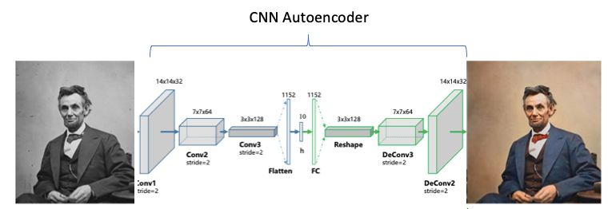
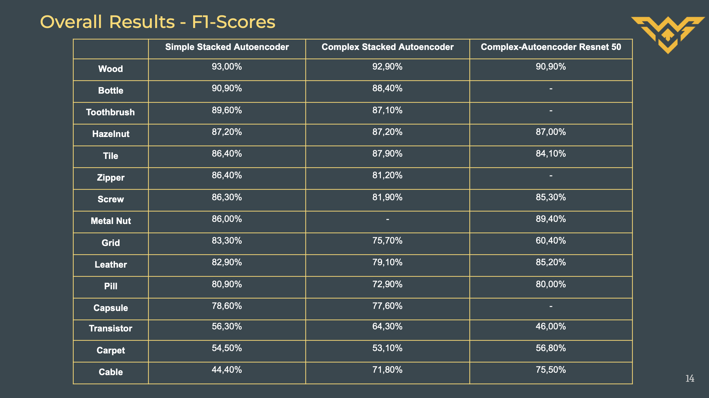

# Anomaly Detection in Manufacturing

## Overview

This project emphasizes the use of an autoencoder architecture, particularly with a pre-trained ResNet-50 model for feature extraction and reconstruction, to address anomaly detection in manufacturing. Traditional and hybrid machine learning approaches are found to be unsatisfactory in comparison. The autoencoder is trained on augmented normal manufacturing data, enabling it to identify anomalies by reconstructing input images and calculating reconstruction errors. The detection process involves comparing the reconstructed images with the original ones, contributing to effective quality control in manufacturing.

## Description

### Jupyter Notebook Descriptions:

- **Support Vector Machines :**  SVM utilies the classical machine learning tool to identify anomaly. It can be treated as a baseline model. 

- **Hybrid Model :** In this file we combine CNN, AutoEncoder with and without pre-trained model (VGG16) in combination with Isolation Forest and Local Outlier Model.

- **Stacked Autoencoder :** Employes two simple autoencoder architecture to identify anomalies. 

- **Autoencoder ResNet :** This model uses **ResNet50** as a backbone in addition to residual blocks and more complex autoencoder structure. 

- **Autoencoder :** This model combines the Autoencoder ResNet50 model with data augmentation and early stopping to identify the best parameters and localize anomalies. 

### Methodology

- **Anomaly Detection**: Calculates the reconstruction error between original and reconstructed images to identify anomalies.
- **Bounding Box Visualization**: Locates anomaly regions by drawing rectangles around areas with high reconstruction errors.
- **Image Segmentation**: Utilizes contour detection to segment and isolate anomalies in the images.
- **Classification**: Implements a classification model to categorize anomalies into different classes based on the MVTec dataset categories.

### Dataset Used

The [MVTec dataset](https://www.mvtec.com/company/research/datasets/mvtec-ad), known for its comprehensive collection of real-world textures and objects, has been used for training and evaluation. This dataset contains images of various materials and objects captured under different conditions, enabling robust anomaly detection models.

## Usage

### Requirements

- Python 3.x
- TensorFlow
- OpenCV
- Matplotlib
- NumPy

### Instructions

1. Clone the repository.
2. Install dependencies: `pip install -r requirements.txt`.
3. Download the [MVTec dataset](https://www.mvtec.com/company/research/datasets/mvtec-ad) and organize it as per project requirements.
4. Run the anomaly detection and classification scripts.

## Results

The system successfully identifies anomalies in manufacturing images from the MVTec dataset, providing visualizations of the detected defects and categorizing them into different classes based on the dataset categories.

## Future Improvements

- Experimentation with different classification pre-trained models for improved feature extraction, accuracy in anomaly classification.
- Fine-tuning the thresholding and anomaly detection parameters for better accuracy.
- Enhancing the segmentation algorithm for precise anomaly isolation.
- Integration of multi-modal information for enhanced anomaly detection and classification.
- Deployment of the model for real-time anomaly detection in manufacturing environments.

## Contribution

Contributions and suggestions are welcome! Feel free to open issues or pull requests.

## License

This project is licensed under [MIT License](LICENSE).

